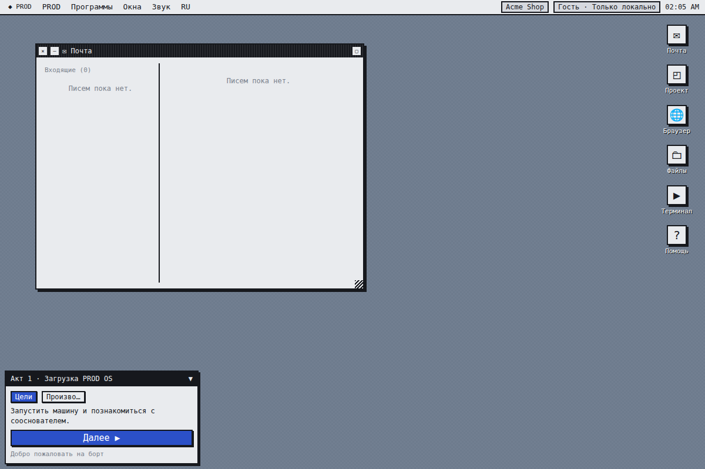

# PROD — Build it. Break it. Scale it.

A browser, single-player **engineering simulator**. You start with one ugly default
page on a rented server and end with a global, observable, secure, multi-region
production system serving millions — and along the way you actually understand *why*
every component exists.

You never write code. You diagnose symptoms, form hypotheses, place and wire
components, flip real settings, run a deterministic simulation, and live with the
consequences. Every technology is named honestly (MySQL, Redis, Nginx, CDN, JWT, …)
and every explanation is simplified but never false.

> **Symptom → observation → hypothesis → investigation → decision → simulation →
> consequences → explanation → the next problem.**

The whole thing is a fictional retro operating system, **PROD OS** — a draggable,
windowed, pixel-font workstation, not a SaaS dashboard in a frame. RU and EN from
the first screen. Playable as a guest with no account.



## What's in the box

* **100-mission campaign** across 12 acts: first byte → backend → API → the real
  internet → caching → async → deployment → observability → **security** → scaling →
  distributed systems → global production, plus a *living production* epilogue.
* A **deterministic simulation engine** that models routing, capacity, latency
  (queueing), databases (EXPLAIN, indexes, locks, deadlocks, replicas, pools),
  caches (TTL/hit/miss/eviction/stale), queues (backlog/retry/DLQ/idempotency),
  external providers (timeouts/retries/circuit breakers), correctness anomalies
  (oversell, double-charge, lost events), cost, and six quality metrics incl.
  **Technical Debt** with real delayed consequences.
* **28 apps**: Mail, Browser, Files, Terminal, Architecture (drag-and-drop canvas
  with animated request flow), Request Inspector (+ Layer Mode), Monitoring, Logs,
  Trace Viewer, Database, API Inspector, Network, DNS, Security Center, **Attack Lab**,
  CI/CD, Git, Queue, Cache, Incident Manager, Runbooks, Finance, Knowledge Map,
  Encyclopedia, **Time Machine**, Servers, Project, Help.
* An 85-node **Knowledge Map** with an Encyclopedia, achievements, NPCs with
  dialogue, and an Attack Lab with Attack Replay.

## Architecture

```
packages/engine   @prod/engine   deterministic simulation + game rules (pure TypeScript, UI-agnostic)
packages/content  @prod/content  all content as JSON (missions, components, settings, knowledge…)
apps/web          @prod/web      Next.js PROD OS (React, Zustand, canvas/SVG, RU/EN)
apps/api                         Laravel REST API: auth, guest, saves, checkpoints, progress
docker/                          Dockerfiles + Caddy reverse proxy
e2e/                             Playwright campaign flow
docs/                            architecture, API, content, Windows dev, Timeweb deploy
```

The engine is a pure function of `(GameState, content)` → simulation; the web client
and the tests both call it directly, and the Laravel API only stores progress. The
real MySQL/Redis/Caddy/Next serve PROD itself — the **in-game** MySQL/Redis/Nginx/…
are only simulation entities, never real containers.

See [`docs/ARCHITECTURE.md`](docs/ARCHITECTURE.md), [`docs/API.md`](docs/API.md),
and [`docs/CONTENT.md`](docs/CONTENT.md).

## Quick start (Docker)

```bash
cp .env.example .env            # set DB passwords
docker compose build
docker compose run --rm --no-deps --entrypoint php api artisan key:generate --show
# paste the printed base64:… value into APP_KEY= in .env
docker compose up
# open http://localhost
```

Run the apps directly for hot reload, or on Windows, see
[`docs/DEV_WINDOWS.md`](docs/DEV_WINDOWS.md). To put it on a VPS, see
[`docs/DEPLOY_TIMEWEB.md`](docs/DEPLOY_TIMEWEB.md).

## Tests

```bash
npm run test:engine     # engine: determinism, EXPLAIN, connection rules, campaign, Time Machine, saves
npm run test:content    # content validation + playable Act I + fact coverage
npm run test:web        # store + window manager
npm run test:e2e        # Playwright: boot→desktop→first mission, windows, RU/EN
cd apps/api && php artisan test     # API: auth, guest, saves (409 concurrency), guest→account merge
```

## Tech

Next.js · React · TypeScript · Zustand · Laravel · MySQL · Redis · Docker · Caddy.

## Learning goal

After the campaign you can explain, in your own words: what happens after you type a
URL; why you need a backend, an API, a database, an index, a cache, a queue, a reverse
proxy, a CDN, DNS, HTTPS; sessions vs JWT; authentication vs authorization; password
hashing and the common web vulnerabilities; CI/CD, rollback and canary; logs, metrics
and traces; how to find a bottleneck; load balancing; vertical vs horizontal scaling;
and the real trade-offs between performance, reliability, security, cost and complexity.
